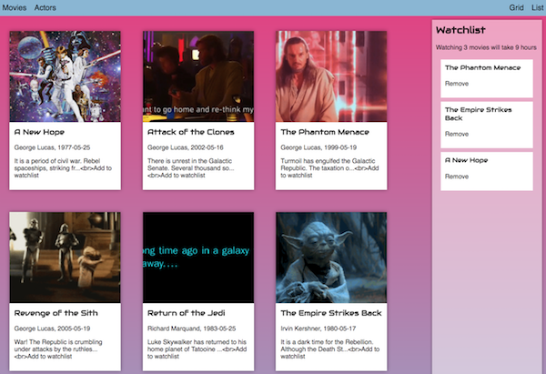

# Vue Workshop

Welcome to the Vue workshop! In this workshop we will learn how to work with Vue, using Typescript, Class Syntax and Single File Components. This workshop is part of the fullstack course. We will use Vue to render a front-end for a RESTful API. 

## What is Vue?

Study the [Vue Workflow](./presentation/workflow.md)

## Installing

Follow the [installation guide](./presentation/install.md)

## Loading JSON data

Our app is going to use data from a RESTful API, so let's take a quick look at loading JSON.

[Loading JSON](./presentation/loading.md). 

## What are we going to learn?

- Single file components
- Class syntax
- Reactive data
- Loading external data and images
- Clicks and conditionals
- Styles

When finished, our project should look like this



## Single file components

A Vue component can bundle HTML, CSS and Typescript code together in one single `.vue` file:

**app.vue**
```
<template>
   <div>HTML markup goes here</div>
</template>

<script lang="ts">
   console.log("typescript code goes here")
</script>

<css scoped>
   div {border: 1px solid black;}
</css>
```
*note that this CSS is scoped. This means that these css rules only apply to the HTML template in the same .vue file*

## Class syntax

In this tutorial, we use *class syntax* to define our Vue components. CMGT PRG06 students are already familiar with this syntax since we used it to build [games in Typescript](https://github.com/HR-CMGT/Typescript). 

Class syntax simplifies how a Vue component is defined. This example compares Vue component in basic javascript syntax and class syntax.

**javascript syntax**
```
var app = new Vue({
  el: '#app',
  data: {
    message: 'Data contains the state of the app',
    turtles: ["Leonardo","Donatello","Michaelangelo","Raphael"]   
  },
  methods: {
    addTurtle:function(){
      this.turtles.push("Another turtle...")
    }
  },
  created() {
    this.message = "Let's list some turtles!"
    setInterval(()=>this.addTurtle(), 5000)
  }
})
```
**class syntax**
```
class App extends Vue {
    message = 'Data contains the state of the app'
    turtles = ["Leonardo","Donatello","Michaelangelo","Raphael"]   
    addTurtle() {
        this.turtles.push("Another turtle...")
    }
    created(){
        this.message = "Let's list some turtles!"
        setInterval(()=>this.addTurtle(), 5000)
    }
}
```
[Read more about class syntax](https://alligator.io/vuejs/typescript-class-components/)

## Kickstarting the app

Now that we have an App class, we can instantiate it in `index.ts`. *The entry file of an application is configured in `webpack.config.js`.*

**index.html**
```
<div id="app"></div>
```

**index.ts**
```
import App from "./components/App.vue"
new App({el: "#app"})
```

## But does it run?

Run `webpack` in your terminal and open the page in localhost. For debugging, open the Vue inspector in Chrome.

## Reactive data

In the old days, without a reactive framework, we had to call an update function every time our data changed:

**manually updating the DOM**
```
<div id="user"></div>
function updateUI(){
   let element = document.getElementById("user")
   element.innerHTML = this.name
}
```
In Vue, (and React, Angular) we can bind DOM elements to data. This is called **reactive data**.  We use moustache syntax `{{ }}` to bind data.

**app.vue - reactive framework**
```
<div>{{ variable }}</div>
class App {
    variable = "hello world"
}
```
Now, the text in the `<div>` will reflect the value of `variable` automatically! Let's try this by adding reactive data to app.vue. 

**app.vue**
```
<template>
   <div>Hello {{ name }}</div>
</template>

<script lang="ts">
import { Vue, Component } from "vue-property-decorator";

@Component
export default class App extends Vue {
    name: string = "world"
}
</script>
```

### Lists

We can render arrays as lists in our HTML by using the `v-for` loop:
```
<ul>
    <li v-for="t in listexample" :key="t">{{ t }}</li>
</ul>

export default class App extends Vue {
    listexample:string[] = ["buy milk", "build vue app"]
}
```

To prove that the DOM updates automatically, let's start a timer that pushes an item into the array:

**app.vue**
```
export default class App extends Vue {
    listexample:string[] = ["buy milk", "build vue app"]
    created(){
        setInterval(()=>this.addItem(), 1000)
    }
    addItem(){
        this.listexample.push("buy more milk")
    }
}
</script>
```
Run `webpack` and open the browser. Does the UI update every second?

## Buttons

By using `@Click` you can bind a DOM element to a method. We'll also use `v-if` to show this button only if the number of items in an array is 0. 

```
<button v-if="turtles.length == 0" @click='addTurtle'>Add a turtle</button>

export default class App extends Vue {
    turtles:string[] = []
    addTurtle(){
       this.turtles.push("Leonardo")
    }
}
```

## Loading JSON data

Our app is going to use data from a RESTful API, so let's take a little sidetour and see how we can load JSON using just ES6.

[Loading JSON](./presentation/loading.md). 

### Displaying JSON

If you followed the JSON tutorial, you now have JSON data containing Star Wars movies. In our HTML template, we create a `<div>` for each entry in the array using a `v-for` loop. Inside the div you can access all the details from one movie:

```
<template>
    <div>
        <button @click='loadData'>Load data</button>
        <div v-for="f in films" :key="f.episode_id">
            <h3>{{f.title}}</h3>
            <p>{{f.director}}, {{f.release_date}}</p>
            <p>{{f.opening_crawl}}</p>
        </div>
    </div>
</template>

export default class App extends Vue {
    films: Film[] = []
    loadData(){
        // load json data and place it in this.films
    }
}
```
## Styles

In the previous example, the loading button is still clickable while the app is busy loading JSON. Let's see if we can disable the button when data is already loading. 

We'll bind a `disabled` CSS class to the button when the `isLoading` status is true.
```
<template>
    <div>
        <button :class="{ disabled: isLoading }" @click='loadMovies'>Load movies</button>
    </div>
</template>

<script lang="ts">
export default class App extends Vue {
    isLoading: boolean = false
}
</script>
<style scoped>
.disabled {
    pointer-events: none;
    opacity: 0.4;
}
</style>
```
Now you can set the `isLoading` variable to true when `fetch` is called, and to false again when loading has finished. The style of the button should automatically update. See if you can add this code yourself!

## Vue Workshop part 2

Congratulations! We have built a Vue component with data binding, button clicks and dynamic styles!

In [part two](./presentation/workshop2.md) we are going to look at how to use multiple components, and how they communicate with each other.

## Reading List

### Documentation

- [Introduction](https://vuejs.org/v2/guide/index.html)
- [Single File Components](https://vuejs.org/v2/guide/single-file-components.html)
- [Typescript support](https://vuejs.org/v2/guide/typescript.html)
- [Class Component](https://github.com/vuejs/vue-class-component)

### Tutorials and examples

- [5 practical examples for learning Vue.js](https://tutorialzine.com/2016/03/5-practical-examples-for-learning-vue-js)
- [Using Class Component with Typescript](https://alligator.io/vuejs/typescript-class-components/)
- [Huge list of Vue Examples and readymade components](https://github.com/vuejs/awesome-vue)
- [CSS Tricks: introduction to Vue](https://css-tricks.com/intro-to-vue-1-rendering-directives-events/)
- [Microsoft Typescript Vue Starter](https://github.com/Microsoft/TypeScript-Vue-Starter)
- [Binding Styles in Vue](https://vuejs.org/v2/guide/class-and-style.html)

### Related

- [Typescript HR CMGT](https://github.com/HR-CMGT/Typescript)
- [Using Headers with Fetch](https://developer.mozilla.org/en-US/docs/Web/API/Fetch_API/Using_Fetch)
- [Using Promises](https://davidwalsh.name/promises)
- [Using Async Await](https://developer.mozilla.org/en-US/docs/Web/JavaScript/Reference/Statements/async_function)
