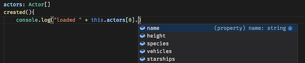

# Working with JSON data

## Loading data

ES6 introduced the [fetch](https://developer.mozilla.org/en-US/docs/Web/API/Fetch_API/Using_Fetch) method to load external data. The fetch method returns a [Promise](https://developer.mozilla.org/en-US/docs/Web/JavaScript/Reference/Global_Objects/Promise). A Promise is an object that allows code to be executed when the function has actually returned anything. We do that by calling `then()` on the Promise object.

In the `getStarWarsData` function we use the new `async await` syntax to return a Promise to the `created` method. 
```
export default class App extends Vue {
    films: Film[] = []
    created(){
        let prom:Promise<any> = this.getStarWarsData()
        prom.then(data => {
            this.films = data
        })
    }
    async getStarWarsData() {
        let res = await fetch("https://swapi.co/api/films/")
        return await res.json()
    }
}
```
To show that `getStarWarsData` returns a Promise, we have used a separate Promise variable. You could omit that variable by calling `.then` directly:
```
created(){
    this.getStarWarsData().then(data => {
        this.films = data 
    })
}
```

*note: The `created` method is automatically called when the component is added to the DOM*


Use the [Chrome Vue plugin](https://chrome.google.com/webstore/detail/vuejs-devtools/nhdogjmejiglipccpnnnanhbledajbpd) to check the state of your component.

## Displaying data

If we assign the JSON to a reactive array, we can automatically populate the UI. You can bind array values to a repeating DOM element with `v-for`. 

In this example Vue will render a `<div>` for every film in our Films array. The variable `f` will contain one film.
```
<template>
    <div>
        <div v-for="f in films" :key="f.episode_id">{{f.title}}</div>
    </div>
</template>
```
*note that Vue wants us to supply a key. This should be a unique value, for example the movie's id*

## JSON Type definitions

Note that the variable that holds the Star Wars JSON is an array of type `Film`. We have defined this type in a `.d.ts` file. VS Code will give you code completion for known types. 



*Check the `starwars.d.ts` file to see how you can declare types for your own RESTful API data.*

## Reading List

- [MDN docs async await](https://developer.mozilla.org/en-US/docs/Web/JavaScript/Reference/Statements/async_function)
- [Why async await is better than Promises](https://hackernoon.com/6-reasons-why-javascripts-async-await-blows-promises-away-tutorial-c7ec10518dd9)