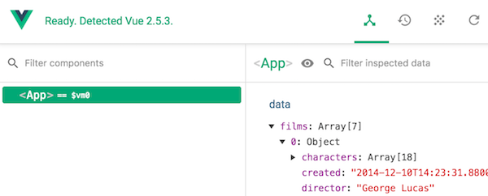

# Working with JSON data

ES6 introduced the [fetch](https://developer.mozilla.org/en-US/docs/Web/API/Fetch_API/Using_Fetch) method to load external data. The fetch method is **asynchronous**, which means that we don't know when it will return data. To handle results from asynchronous functions, we can use **Promises** or **Async Await** syntax.

## Promises

A **Promise** object allows us to define code that will be executed *once the data has loaded*. Place this code in a `then()` call.
```
function getStarWarsData() {
    fetch('http://swapi.co/api/people/1/')
        .then(res => res.json())
        .then(res => {
            this.films = res
        })
}
```
## Async await

[Async await](https://developer.mozilla.org/en-US/docs/Web/JavaScript/Reference/Statements/async_function) is a new syntax that makes asynchronous methods more readable.
In this example, the variable `this.films` will be filled once the API call has returned a result!

```
async getStarWarsData() {
    let res = await fetch("https://swapi.co/api/films/")
    this.films = await res.json()
}
```

*note: in the case of the star wars API, the actual movies are in res.results, so you have to type: `this.films = (await res.json()).results`*

## Example Vue Component

Because an async function returns a Promise, we need `then()` to handle the result.

```
export default class Card extends Vue {
    films:Film[] = film[]
    created(){
        this.getStarWarsData().then(data => {
            this.films = data.results
            console.log("The first title is " + this.films[0].title)
        })
    }

    async getStarWarsData() {
        let res = await fetch("https://swapi.co/api/films/")
        return await res.json()
    }
}
```

## Sending headers

We can send headers and POST data with `fetch` as well!
```
export default class App extends Vue {
    async getWebserviceData() {
        const myHeaders:Headers= new Headers({
              'Content-Type': 'application/json'
        })

        const myInit:RequestInit = { method: 'GET',
                    headers: myHeaders,
                    mode: 'cors',
                    cache: 'default' };

        const url = "your webservice url here"

        let res = await fetch(url, myInit)
        return await res.json()
    }
}
```
## Checking loaded data in the Chrome plugin

Use the [Chrome Vue plugin](https://chrome.google.com/webstore/detail/vuejs-devtools/nhdogjmejiglipccpnnnanhbledajbpd) to check the state of your component.



## Displaying data

If we assign the JSON to a reactive array, we can automatically populate the UI. You can bind array values to a repeating DOM element with `v-for`. In this example Vue will render a `<div>` for every film in our Films array. The variable `f` will contain one film.
```
<div v-for="f in films" :key="f.episode_id">{{f.title}}</div>
```
*note that Vue wants us to supply a key. This should be a unique value, for example the movie's id*

## JSON Type definitions

Note that the variable that holds the Star Wars JSON is an array of type `Film`. We have defined this type in `starwars.d.ts`. VS Code will give you code completion for known types. 


*Check the `starwars.d.ts` file to see how you can declare types for your own RESTful API data.*

## Reading List
- [Using Fetch](https://developer.mozilla.org/en-US/docs/Web/API/Fetch_API/Using_Fetch)
- [Using headers with fetch](https://developer.mozilla.org/en-US/docs/Web/API/Headers)
- [MDN docs async await](https://developer.mozilla.org/en-US/docs/Web/JavaScript/Reference/Statements/async_function)
- [Why async await is better than Promises](https://hackernoon.com/6-reasons-why-javascripts-async-await-blows-promises-away-tutorial-c7ec10518dd9)
- [Promises](https://developer.mozilla.org/en-US/docs/Web/JavaScript/Reference/Global_Objects/Promise)