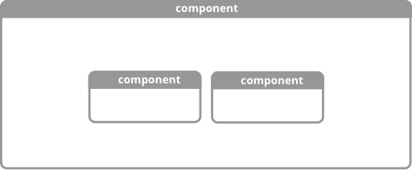
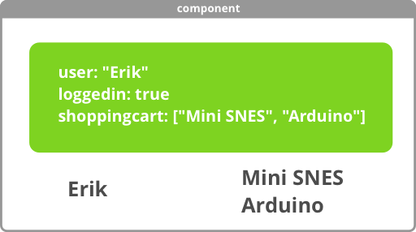
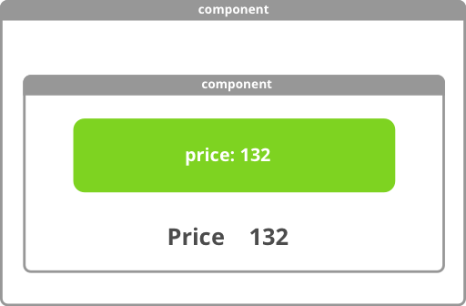
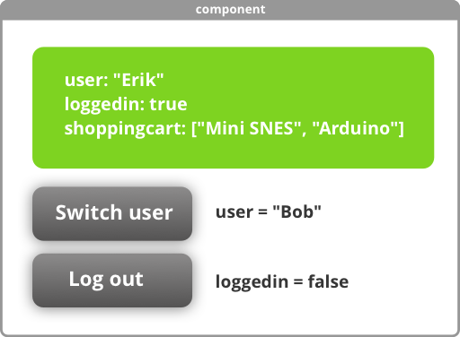
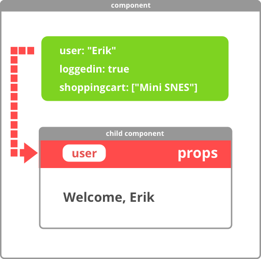
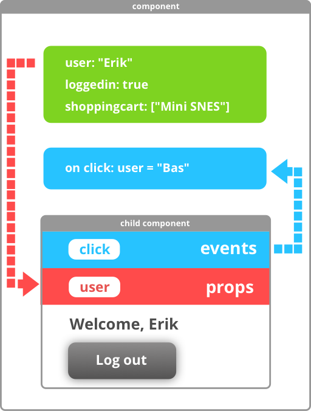
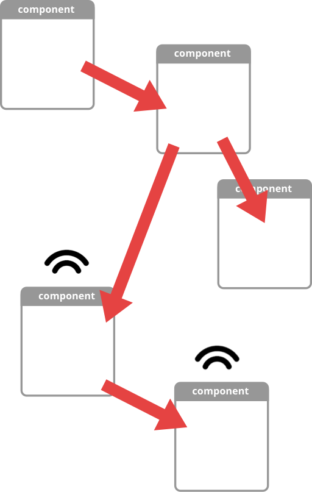

# Vue Workflow

This presentation will show you the concept behind building a Vue application.

## UI represents state

Vue components are like UI Lego blocks. UI blocks visualise the **state** of your application. By state we mean all the internal variables of a component, for example a `username`.

## Encapsulation

Encapsulation means that a Vue component has no knowledge of its context, and the internal workings of a component are hidden from the outside world. A component has full control over its own state, and cannot access or alter the state of any other component.

## UI building blocks

A component can have child components

---

## State

A component can have a state. State contains all the variables of your component. A component can **display** its own state in the **UI**.

In this example, our component has data for a user, a login status, and a shopping cart, and displays the user name and cart contents in the UI.

Child components can have their own state.

A component can change its own state. In this example, clicking the **log out** button will change the loggedin state to false.

---
## Props

When our UI becomes more complex, we may want our child components to be able to display the state of a parent. This is done using **props**. 

A **prop** is a *read-only* variable. A component can only **display** a prop but not alter it.

If the state of a parent component changes, all props are automatically updated. In this example, the child can display the user name of the parent.

---
## Events

If we want a parent component to respond to changes in a child component, we have to listen to **events** that the child **emits**. 

The reason Vue works like this, is that the child does not need to know who is listening to the event. In other words, the child is still ignorant about its surroundings (*encapsulation*)

The parent needs to have an event handler that decides what happens if the child emits an event. This way, the parent retains full control over its own state.

---

## Unilateral data flow

You may have noticed that components only ever pass data DOWN to child components. This is called unilateral data flow. The only way to respond to changes in child components, is to listen to events.

You made it! You can continue with [part 1 of the workshop](../README.md).