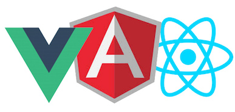

# Vue



Vue is a *library* that enables you to build a super-fast UI (a View) for your website or web application, using *components*. Vue is very similar to React, meaning that you still have to build your own application logic that sits behind the UI. You can extend Vue and React with routers or data stores, but you don't *have to*.

The main difference with Angular is that Angular provides you with a complete application *framework*, including a strict workflow that dictates how you should use it - the UI is only part of that. You might consider Angular a bit overkill if you need a simple front-end UI, especially considering its steep learning curve.

## Components

Web components isolate functionality in a single HTML element. Consider a [single-page website](https://www.google.com/search?tbm=isch&source=hp&biw=1526&bih=993&ei=WhEUWr-TD9KTkwWZ3ZS4Ag&q=single+page+website&oq=single+page&gs_l=img.3.0.35i39k1j0l9.1962.2944.0.3994.12.12.0.0.0.0.139.934.6j5.11.0....0...1ac.1.64.img..1.11.933.0...0.H_CHxAmn5iY) with a basic layout. When using *components*, your HTML might look like this:
```
<html>
    <navigation></navigation>
    <slideshow></slideshow>
    <testimonials></testimonials>
    <footer></footer>
</html>
```
Every component can contain its own HTML, CSS and Javascript! An individual Vue component looks like this:
```
<div>
    <p>This is the HTML of the component</p>
</div>
<script>
    // this is the code for the component
</script>
<css>
   p { /*this css applies to this component*/ }
</css>
```

## Reactive data

Vue components can have an internal **state**, meaning private variables. You can **bind** those variables to DOM elements of the same component. This will cause changes in the variables to be immediately reflected by the DOM element. This is called *reactive data*. 
```
<div>
    {{ username }}
</div>
<script>
    username = "erik"
</script>
```
Note that a Vue component only has access to its own DOM elements. Components do not know anything about their surroundings and cannot just access other components. This is called **encapsulation**. 

Now, let's look at how you can piece together a Vue application using components!

## UI building blocks


A component can have **child components**

---

## State


A component can have a state and display that state in the **UI**.


Child components can have their own state.


A component can change its own state. In this example, clicking the **log out** button will change the loggedin state to false.
---
## Props


When our UI becomes more complex, we may want child components to be able to display the state of a parent. This is done using **props**. A **prop** is a *read-only* variable. A component can only **display** a prop but not alter it.

---
## Events


If we want a parent component to respond to changes in a child component, we have to listen to **events** that the child **emits**. 

The reason Vue works like this, is that the child does not need to know who is listening to the event. Only the parent can change its own state.

---

## Unilateral data flow

You may have noticed that components only ever pass data DOWN to child components. This is called unilateral data flow. The only way to respond to changes in child components, is to listen to events.

Generally, it's a good idea to have only one main state (a *source of truth*) in your application - you could maintain this state in your root Vue component. The main component passes props down to child components that need to know about this state. 

Child components only have their own state when their internal variables are irrelevant to the outside application.


You made it this far! Hopefully you have an idea of what a Vue app looks like, at least theoretically. Now let's build something practical in [part 1 of the workshop](../README.md).
