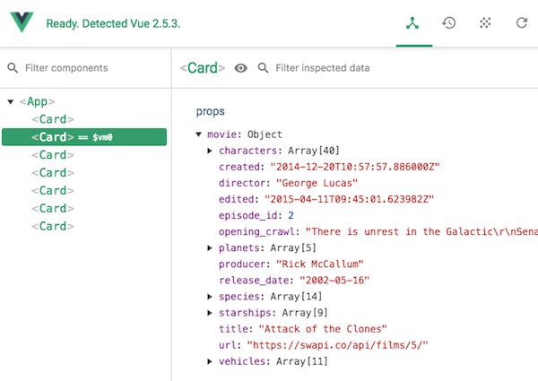

# Vue Workshop

This is part 2 of the Vue workshop. Please follow [part 1](../README.md) first! In this part we will work with Child components, props and events. We will build a complete frontend for our Star Wars API.

## Child components

When looping through the `films` array at the end of part 1, we ended up with the following template:
```
<template>
    <div>
        <div><h2>{{ title }}</h2></div>
        <div class="card" v-for="f in films" :key="f.episode_id">
            <h3>{{f.title}}</h3>
            <p>{{f.director}}, {{f.release_date}}</p>
            <p>{{f.opening_crawl}}</p>
        </div>
    </div>
</template>
```
Let's start by removing all the movie detail HTML and replace it with `<card>`. The card will hold all the detail HTML.
```
<template>
    <div>
        <div><h2>{{ title }}</h2></div>
        <card></card>
    </div>
</template>
```
## The card component

Create a `Card.vue` file:

**Card.vue**

```
<template>
    <div>
        <h3>I am a card!</h3>
    </div>
</template>

<script lang="ts">
import { Vue, Component, Prop } from "vue-property-decorator";

@Component
export default class Card extends Vue {
    created(){
        console.log("Card is created!")
    }
}
</script>

<style scoped>
</style>
```

## Importing the Card component

To use the Card component in the main App, we'll need to:
- `import` the card component. 
- use the `@component` decorator to *register* Card as a Vue component
- use `<card></card>` in our template!

**App.vue**

```
<template>
    <div>   
        <h2>Vue app</h2>
        <card></card> 
    </div>   
</template>

<script lang="ts">
    import { Vue, Component, Prop } from "vue-property-decorator"
    import Card from "./card.vue"

    @Component({
        components: {Card}
    })

    export default class App extends Vue {
        // app code here
    }
</script>

<style>
</style>
```
### Does it run?

Check your browser and see if the child component is correctly loaded!

## Passing data to a child component

We want our card to display movie details, so let's pass some data from App to Card. This is done using **props**.

**App.vue**

We'll start by passing the literal string "The Force Awakens" to the card:

`<card movietitle="The Force Awakens"></card>`

**Card.vue**

The card component needs to know that the parent is sending a variable (a *Prop*). We do this by typing `@Prop()` before the variable declaration:

```
<template>
    <div>
        <div>{{movietitle}}</div>
    </div>
</template>
@Component
export default class Card extends Vue {
    @Prop() movietitle: string;
}
```

Again, check if this runs in your browser!

We might not want to pass "The Force Awakens" to every card component. We can use `v-bind:movietitle`, or the shortcut `:movietitle` to pass a variable:

`<card :movietitle="title"></card>`

### Displaying a Card for each movie

In part 1 we used `v-for` to display a `<div>` for each movie. This works for components too. 

`<card v-for="f in films" :key="f.episode_id" :movietitle="f.title"></card>`

This should display a list of cards with all titles from the Star Wars movies! Check if it runs in your browser 👨🏼‍💻

### Passing an entire object

Instead of passing just the movie title, we might as well pass the entire movie object. 

**App.vue**

`<card v-for="f in films" :key="f.episode_id" :movie="f"></card>`

Now, we can display all movie details from inside the card component. Note that `movie` is a `@Prop()`.

**Card.vue**
```
<template>
    <div class="card">
        <h3>{{movie.title}}</h3>
        <p>{{movie.director}}, {{movie.release_date}}</p>
        <p>{{movie.opening_crawl}}</p>
    </div>
</template>

<script lang="ts">
import { Vue, Component, Prop } from "vue-property-decorator";

@Component
export default class Card extends Vue {
    @Prop() movie: Film;
}
</script>

<style scoped>
.card {
    background-color:white;
    padding:10px; margin-bottom:10px;
    border-radius:6px;
}
</style>
```

If everything went well, your Chrome Debugger should look like this:



## Props are reactive

A prop is a variable that is maintained by the parent, not by the child. In the above exercise, the list of movies is maintained by `App.vue` and displayed by `Card.vue`. If the array in `App.vue` changes, all cards will be automatically updated!

Because a prop is bound to the parent, you should not try to alter a movie's details in `Card.vue`.

### Copying props to a local state

If you DO want to be able to change data that you received as a Prop, you should copy the Prop first to a local variable. 

```
export default class Block extends Vue {
    @Prop() initialValue: number
    myValue = this.initialValue
    increment() {
        this.myValue++
    }
}
```

## Events

TODO

- emit
- listen

## Typescript files

Up until now, all our logic was part of a visual UI component. But once your app becomes a bit more complex, it might make more sense to put non-UI code in a separate Typescript file. This also makes the code reusable among multiple components. 

Let's extract our data loading code into its own component:


## Router and VueX

TODO